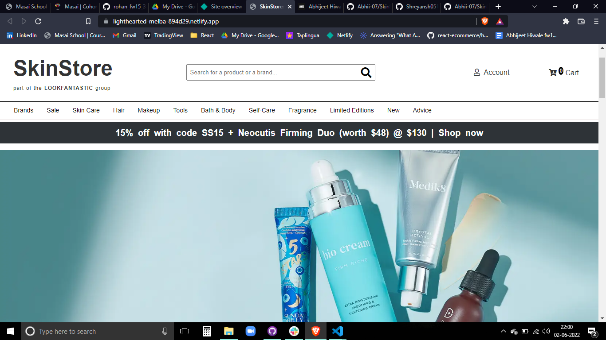

# SkinStore.com-Clone
Clone of SkinStore.com built with HTML5,CSS3,JavaScript

# SkinStore.com-Clone

This project is a Clone of SkinStore.com , an E-commerce website for purchasing Skincare and Beauty products

Tech Stack : The tech Stack we used for creating this website are :-

## Languages Used

- Html
- JavaScript
- CSS
- Import Export Modules

## Functional Things :

- User Signup Popup/model.
- User Login Popup/model.
- Navbar Using Import Export Modules.
- Products Page.
- Quick View Popup/model
- All types of Sort/Filter Functionality.
- Add to cart Button.
- Multiple Images view on Hovering over images on Products page & Quick view Page.

Clone link => [https://rad-wisp-02436f.netlify.app](https://lighthearted-melba-894d29.netlify.app/)

